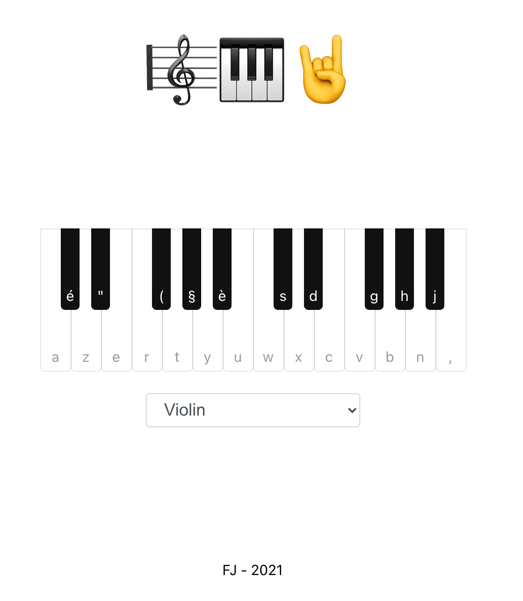

# Musical Keyboard, with typescript and react

A learning project: a musical keyboard done in react and typescript.

It uses a few libs: soundfont-player, and clsx, for constructing className strings conditionally
